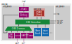

# Croc System-on-Chip

A simple SoC for education using PULP IPs. Croc includes all scripts necessary to produce a nearly finished chip in [IHPs open-source 130nm technology](https://github.com/IHP-GmbH/IHP-Open-PDK/tree/main).

As it is oriented towards education, it forgoes some configurability to increase readability of the RTL and scripts.

Croc is developed as part of the PULP project, a joint effort between ETH Zurich and the University of Bologna.

## Architecture



The SoC is composed of two main parts:
- The `croc_domain` containing an Ibex core, SRAM, an OBI crossbar and a few simple peripherals 
- The `user_domain` where students are invited to add their own designs or other open-source designs (peripherals, accelerators...)

The main interconnect is OBI, you can find [the spec online](https://github.com/openhwgroup/obi/blob/072d9173c1f2d79471d6f2a10eae59ee387d4c6f/OBI-v1.6.0.pdf). 

The various IPs of the SoC (UART, OBI, debug-module, timer...) come from other PULP repositories and are managed by [bender](https://github.com/openhwgroup/obi/blob/072d9173c1f2d79471d6f2a10eae59ee387d4c6f/OBI-v1.6.0.pdf).  
To make it easier to browse and understand, only the currently used files are included in `rtl/<IP>`. You may want to explore the repositories of the respective IPs to find their documentation or additional functionality, the urls are in `Bender.yml`.

## Configuration

Many configurations are in the configuration object:

| Parameter           | Default          | Function                                              |
|---------------------|------------------|-------------------------------------------------------|
| `HartId`            | `0`              | Core's Hart ID                                        |
| `PulpJtagIdCode`    | `32'h1_0000_db3` | Debug module ID code                                  |
| `NumExternalIrqs`   | `4`              | Number of external interrupts into Croc domain        |
| `BankNumWords`      | `512`            | Number of 32bit words in a memory bank                |
| `NumBanks`          | `2`              | Number of memory banks                                |

## Bootmodes

Currently the only way to boot is via JTAG.

## Memory Map

If possible, the memory map should be remain compatible with [Cheshire's memory map](https://pulp-platform.github.io/cheshire/um/arch/#memory-map).


| Start Address   | Stop Address    | Description                                |
|-----------------|-----------------|--------------------------------------------|
| `32'h0000_0000` | `32'h0004_0000` | Debug module (JTAG)                        |
| `32'h0300_0000` | `32'h0300_1000` | SoC control/info registers                 |
| `32'h0300_2000` | `32'h0300_3000` | UART peripheral                            |
| `32'h0300_A000` | `32'h0300_B000` | Timer peripheral                           |
| `32'h1000_0000` | `+SRAM_SIZE`    | Memory banks (SRAM)                        |


## Requirements

### ETHZ systems
An environment setup for bash is provided.
```sh
source ethz.env
```

### Other systems
**Note: this has currently only been tested on Ubuntu Linux.**  

#### Docker (easy) 
There are two possible ways, the easiest way is to install docker and work in the docker container, you can follow the install guides on the [Docker Website](https://docs.docker.com/desktop/):

It is a good idea to grant non-root (`sudo`) users access to docker, this is decribed in the [Docker Article](https://docs.docker.com/engine/install/linux-postinstall/#manage-docker-as-a-non-root-user).

Finally, you can navigate to this directory, open a terminal and type:
```sh
# Linux/Mac
./docker.sh
# Windows
./start_x.bat
```

Now you should be in a Ubuntu environment with all tools pre-installed for you.  
If something does not work, refer to the upstream [IIC-OSIC-Tools](https://github.com/iic-jku/IIC-OSIC-TOOLS/tree/main)

#### Native install (hard)
You need to build/install the required tools manually:

- [Bender](https://github.com/pulp-platform/bender#installation): Dependency manager
- [Morty](https://github.com/pulp-platform/morty#install): SystemVerilog pickler
- [SVase](https://github.com/pulp-platform/svase#install--build): SystemVerilog pre-elaborator
- [SV2V](https://github.com/zachjs/sv2v#installation): SystemVerilog to Verilog
- [Yosys](https://github.com/YosysHQ/yosys#building-from-source): Synthesis tool
- [OpenRoad](https://github.com/The-OpenROAD-Project/OpenROAD/blob/master/docs/user/Build.md): Place & Route tool
- (Optional) [Verilator](https://github.com/verilator/verilator): Simulator
- (Optional) Questasim/Modelsim: Simulator


## Getting started
The SoC is fully functional as-is and a simple software example is provided for simulation.
To run the synthesis and place & route flow execute:
```sh
make checkout
make pickle
make yosys
make openroad
```

To simulate you can use:
```sh
make verilator
```

If you have Questasim/Modelsim, you can also use:
```sh
make vsim
```


The most important make targets are documented, you can list them with:
```sh
make help
```


### Flow
```mermaid
graph LR;
	Bender-->Morty;
	Morty-->SVase;
	SVase-->SV2V;
	SV2V-->Yosys;
	Yosys-->OpenRoad;
```
1. Bender provides a list of SystemVerilog files
2. These files are pickled into one context using Morty
3. The pickled file is simplified using SVase
4. The simplified SystemVerilog code is run through SV2V
5. This gives us synthesizable Verilog which is then loaded into Yosys
6. In Yosys the Verilog RTL goes through various passes and is mapped to the technology cells
7. The netlist, constraints and floorplan are loaded into OpenRoad for Place&Route

## License
Unless specified otherwise in the respective file headers, all code checked into this repository is made available under a permissive license. All hardware sources and tool scripts are licensed under the Solderpad Hardware License 0.51 (see `LICENSE.md`). All software sources are licensed under Apache 2.0.
